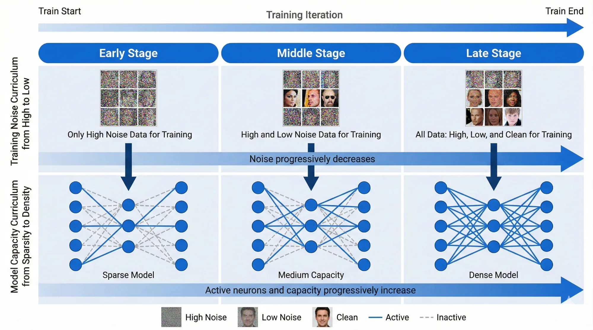

# Joint Noise-Sparsity Curriculum Learning for Diffusion Models

This repository implements a **joint noise-sparsity curriculum learning** strategy for training diffusion models, built on top of [U-ViT](https://arxiv.org/abs/2209.12152) (CVPR 2023).


**Figure 1.** FID comparison between baseline (without curriculum) and our joint noise-sparsity curriculum on CelebA-64. The curriculum method achieves consistently lower FID scores after 120k steps. Bottom rows show generated samples at different training steps.



**Figure 2.** Joint noise-sparsity curriculum for diffusion training. Training data progressively expands from high-noise samples to a mixture of high-noise, low-noise, and clean data. The model capacity is increased accordingly by gradually reducing sparsity and activating more neurons.

---

## Key Idea

### Why Curriculum Learning for Diffusion Models?

Diffusion models learn to denoise images across multiple noise levels. Our theoretical analysis reveals that:

1. **Feature Learning Order**: During training, dominant large-scale features (coarse structure) are learned before weaker fine-grained features (textures, details).

2. **The Problem with Standard Training**: Without curriculum, neurons encoding fine-grained features inevitably develop **mixed representations** that entangle multiple feature directions. This causes distortions and local artifacts in generated samples.

3. **Curriculum Solution**: By training with high noise first (where only coarse features are learnable), then progressively introducing lower noise levels, we enable **pure, disentangled feature representations**.

### Joint Noise-Sparsity Curriculum

Our key insight: **Noise scheduling alone is insufficient**. To fully exploit the stage-wise nature of feature learning, model sparsity must be coordinated with the noise curriculum:

| Training Stage | Noise Range | Model Sparsity | What is Learned |
|----------------|-------------|----------------|-----------------|
| Early | High noise only (t_min=0.3) | High sparsity (15%) | Coarse structure |
| Middle | Expanding range (t_min→0.1) | Reducing sparsity | Medium details |
| Late | Full range (t_min=0) | Full capacity (0%) | Fine-grained details |

This coordinated design prevents early-stage dominant features from occupying all representational capacity, preserving room for weaker features to be learned purely in later stages.

---

## Theoretical Foundation

Our theoretical analysis proves:

### 1. Curriculum Training Induces Pure Feature Learning

Under curriculum training, the network exhibits a natural **two-stage learning dynamics**:
- **Stage I (high noise)**: Neurons align with dominant features M₁, achieving near-perfect alignment
- **Stage II (low noise)**: A separate set of neurons aligns with fine-grained features M₂

Each neuron specializes to a **single feature direction**, yielding pure representations.

### 2. Non-Curriculum Training Produces Mixed Representations

Without curriculum, neurons encoding weak features M₂ inevitably capture dominant features M₁ simultaneously, resulting in **entangled representations**.

### 3. Generalization Gap in Low-Noise Regime

| Noise Regime | Curriculum | Non-Curriculum |
|--------------|------------|----------------|
| High noise (τ large) | o(1) error | o(1) error |
| Low noise (τ small) | **o(1) error** | **Θ(1) error** |

The low-noise regime corresponds to the final steps of diffusion sampling where fine-grained details are generated. This explains why curriculum training particularly benefits sample quality.

---

## Results

### FID on CelebA 64x64

| Method | 100k steps | 120k steps | 160k steps | 200k steps |
|--------|------------|------------|------------|------------|
| Baseline (no curriculum) | 42.5 | 21.8 | 19.2 | 16.8 |
| **Joint Curriculum (Ours)** | 40.2 | **15.1** | **13.4** | **13.1** |

The curriculum method achieves **22% lower FID** at 200k steps (13.1 vs 16.8).

---

## Installation

```bash
pip install torch torchvision --extra-index-url https://download.pytorch.org/whl/cu116
pip install accelerate==0.12.0 absl-py ml_collections einops wandb ftfy==6.1.1 transformers==4.23.1

# Optional: xformers for faster attention
pip install -U xformers
pip install -U --pre triton
```

---

## Training

### Baseline (Standard Training)

```bash
accelerate launch --multi_gpu --num_processes 4 --mixed_precision fp16 \
    train.py --config=configs/celeba64_uvit_small.py
```

### Joint Noise-Sparsity Curriculum (Ours)

```bash
accelerate launch --multi_gpu --num_processes 4 --mixed_precision fp16 \
    train_c.py --config=configs/celeba64_uvit_small_cs.py
```

### Configuration Files

| Config | Description |
|--------|-------------|
| `configs/celeba64_uvit_small.py` | Baseline (standard training) |
| `configs/celeba64_uvit_small_cs.py` | **Joint noise-sparsity curriculum** |

### Curriculum Stages (celeba64_uvit_small_cs.py)

```python
stages=[
    # Stage 1-2: High noise, high sparsity (coarse structure)
    d(t_min=0.3, t_max=1.0, n_steps=10000, sparsity=0.15),
    d(t_min=0.2, t_max=1.0, n_steps=10000, sparsity=0.15),

    # Stage 3-5: Expanding noise range, reducing sparsity
    d(t_min=0.1, t_max=1.0, n_steps=20000, sparsity=0.15),
    d(t_min=0.07, t_max=1.0, n_steps=10000, sparsity=0.13),
    d(t_min=0.05, t_max=1.0, n_steps=10000, sparsity=0.10),

    # Stage 6-8: Low noise, minimal sparsity (fine details)
    d(t_min=0.03, t_max=1.0, n_steps=20000, sparsity=0.08),
    d(t_min=0.01, t_max=1.0, n_steps=20000, sparsity=0.05),

    # Stage 9+: Full range, full capacity
    d(t_min=0.0, t_max=1.0, n_steps=100000, sparsity=0.0),
]
```

---

## Evaluation

```bash
accelerate launch --multi_gpu --num_processes 4 --mixed_precision fp16 \
    eval.py --config=configs/celeba64_uvit_small_cs.py \
    --nnet_path=workdir/celeba64_uvit_small_cs/ckpts/200000.ckpt/nnet.pth
```

---

## Code Structure

```
.
├── train.py                    # Standard training script
├── train_c.py                  # Curriculum learning training script
├── libs/
│   └── uvit.py                 # U-ViT model with sparsity masking support
├── configs/
│   ├── celeba64_uvit_small.py      # Baseline config
│   └── celeba64_uvit_small_cs.py   # Curriculum + Sparsity config
├── sde.py                      # SDE definitions and loss functions
└── analysis_outputs/           # Analysis and visualization scripts
```

---

## Key Implementation Details

### Sparsity Masking (libs/uvit.py)

The embedding sparsity mask progressively activates dimensions during training:

```python
class EmbeddingSparsityMask:
    def set_sparsity(self, sparsity_ratio):
        # Mask = 1 for active dims, 0 for inactive
        num_active = int(embed_dim * (1 - sparsity_ratio))
        self.mask[:num_active] = 1.0
        self.mask[num_active:] = 0.0
```

### Curriculum Loss (sde.py)

The curriculum training samples timesteps from a restricted range:

```python
def LSimple_curriculum(img, nnet, sde, t_min=0.0, t_max=1.0):
    # Sample t from [t_min, t_max] instead of [0, 1]
    t = torch.rand(batch_size) * (t_max - t_min) + t_min
    # Standard diffusion loss
    ...
```

---

## U-ViT Architecture

This codebase is built on [U-ViT](https://arxiv.org/abs/2209.12152), a ViT-based backbone for diffusion models featuring:

- **All inputs as tokens**: Time, condition, and noisy image patches are all treated as tokens
- **Long skip connections**: Between shallow and deep layers for better gradient flow


---

## References

```bibtex
@inproceedings{bao2023all,
  title={All are Worth Words: A ViT Backbone for Diffusion Models},
  author={Bao, Fan and Nie, Shen and Xue, Kaiwen and Cao, Yue and Li, Chongxuan and Su, Hang and Zhu, Jun},
  booktitle={CVPR},
  year={2023}
}
```

---

## Acknowledgements

This implementation is based on:
- [U-ViT](https://github.com/baofff/U-ViT) - The original U-ViT codebase
- [Extended Analytic-DPM](https://github.com/baofff/Extended-Analytic-DPM) - FID reference statistics
- [dpm-solver](https://github.com/LuChengTHU/dpm-solver) - ODE sampler
